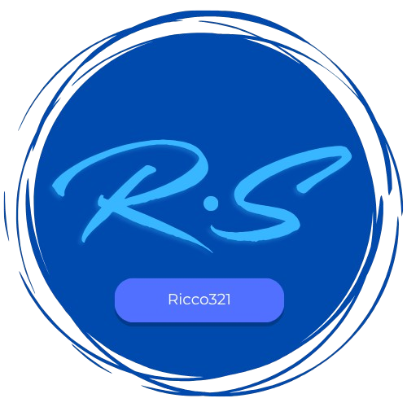

<a name="readme-top">

<br/>

<br />
<div align="center">
  <a href="https://github.com/Ricco321/">
    
  </a>
  <h3 align="center">WD-Finals-Portfolio</h3>
</div>
<div align="center">
  A multi-page personal portfolio website created as a final project to demonstrate foundational web design and development skills.
</div>

<br />


[](https://wakatime.com/badge/user/018dd99a-4985-4f98-8216-6ca6fe2ce0f8/project/63501637-9a31-42f0-960d-4d0ab47977f8)

---

<br />
<br />

<details>
  <summary>Table of Contents</summary>
  <ol>
    <li>
      <a href="#overview">Overview</a>
      <ol>
        <li>
          <a href="#key-components">Key Components</a>
        </li>
        <li>
          <a href="#technology">Technology</a>
        </li>
      </ol>
    </li>
    <li>
      <a href="#rule,-practices-and-principles">Rules, Practices and Principles</a>
    </li>
    <li>
      <a href="#resources">Resources</a>
    </li>
  </ol>
</details>

---

## Overview


### What is the project

WD-Finals-Portfolio is a final web development project that involves designing and building a multi-page personal portfolio website using HTML and CSS. It serves as a culminating activity that allows students to apply their knowledge of basic web development principles through practical, creative, and self-expressive design. The website showcases the student’s identity, skills, interests, and previous works in a structured and visually engaging format.

### What is the purpose

The purpose of this project is to assess and strengthen students' understanding of web development by requiring them to design and implement a fully functional, multi-section portfolio website. It encourages them to apply best practices in layout, structure, and styling using only HTML and CSS. The project also helps students express their personality, skills, and creative approach through their website content and visual design.


### What are key components
- A fully structured multi-page personal website

- A professionally styled landing page and content sections

- Consistent layout and design across all pages

- Use of typography and iconography to enhance clarity and visual appeal

- Smooth transitions and animations to support interactivity
- Image gallery to display project work

- Functional buttons and links for easy navigation

- Integration of media to showcase skills and personality

- Dedicated pages for hobbies, skills, and personal introduction

### What technology used and how it is used
This project uses:
- HTML for structuring the content of each web page, including headings, images, text blocks, and navigation elements.

- CSS for styling the visual appearance of the site — including layout design, colors, fonts, transitions, responsive design, and visual presentation.

### Key Components
1. MultiPage Website – A website composed of multiple HTML pages such as index.html, about.html, and projects.html, allowing for content to be organized and presented in a logical, accessible manner.

2. Title Page – The introductory page that welcomes users to the portfolio. It includes a main heading, possibly a tagline or short introduction, and sets the visual tone for the rest of the site.

3. Iconography – Use of icons to visually represent content such as hobbies, skills, or social links. Icons enhance readability and guide user attention effectively.

4. Typography – Proper font selection and styling contribute to better readability, structure, and aesthetic appeal of the portfolio content.

5. Transitions and Animations – Subtle animations and hover effects bring the site to life and create a more interactive and polished user experience.

6. Buttons and Links – Styled and functional navigation elements help users explore different pages, sections, and external resources.

7. Headers and Footers – Consistent top and bottom sections used across pages to improve navigation, branding, and accessibility.

8. Landing Page – A visually compelling home page that introduces the student and directs users to explore more about their background and work.

9. About Me Page – A personal introduction section describing the student’s background, personality, and interests in a concise and engaging manner.

10. Hobbies and Skills Page – A showcase of the student’s personal interests and skillset, often accompanied by icons or visuals to enhance presentation.

11. Gallery of Projects Page – A dedicated space to highlight the student’s past projects, possibly with images, links, and descriptions to demonstrate their capabilities.

12. Involved With Page – A dedicated page that highlights the student’s involvement in organizations, communities, extracurricular activities, or volunteer services. This page provides insight into the student’s collaborative experiences, leadership roles, and contributions beyond academics, helping to portray a well-rounded personal and professional identity.

### Technology


## Rules, Practices and Principles
1. Always use `WD-` in the front of the Title of the Project for the Subject followed by your custom naming.
2. Do not rename any .html files; always use `index.html` as the filename.
3. Place Files in their respective folders.
4. All file naming are in camel case.
   - Camel case is naming format where there is no white space in separation of each words, the first word is in all lower case while the succeding words first letter are in upper followed by lower cased letters.
   - ex.: buttonAnimatedStyle.css
5. Use only `External CSS`.
6. Renaming of Pages folder names are a must, and relates to what it is doing or data it holding.
7. File Structure to follow below.

```
WD-ProjectName
└─ assets
|   └─ css
|   |   └─ style.css
|   └─ img
|   |   └─ fileWith.jpeg/.jpg/.webp/.png
|   └─ js
|       └─ script.js
└─ pages
|  └─ pageName
|     └─ assets
|     |  └─ css
|     |  |  └─ style.css
|     |  └─ img
|     |  |  └─ fileWith.jpeg/.jpg/.webp/.png
|     |  └─ js
|     |     └─ script.js
|     └─ index.html
└─ index.html
└─ readme.md
```

## Resources

| Title | Purpose | Link |
|-|-|-|-|-|-|-|-|-|-|-|-|-|
| ChatGPT | For generating code snippets, design ideas, explanations, and writing help |https://chatgpt.com/|
| Youtube | For watching tutorials and guides related to HTML, CSS, and design practices|https://www.youtube.com/|
| Google | For quick searches on syntax, concepts, examples, and troubleshooting   |https://www.google.com/|
| Google Fonts | To select and embed custom web fonts that enhance typography and design| https://fonts.google.com/|
| Pinterest | 	For gathering visual inspiration and UI layout ideas|https://ph.pinterest.com/|
| W3 Schools| For referencing HTML/CSS tutorials, syntax explanations, and code examples |https://www.w3schools.com/|
